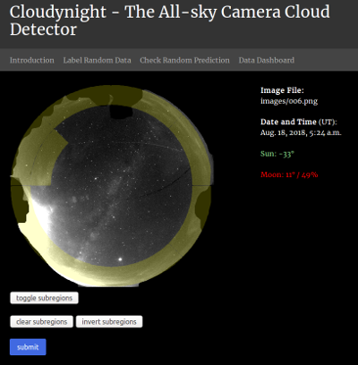

Cloudynight Webapp
==================

The ``cloudynight`` web application allows the user to establish a database
for feature and image data, and enables the setup of visualization and
training tools. Using the Django Restframework, the system features a RESTful
API for data access, which makes it extremely versatile.

Please note that this system will not work out of the box. Instead, the user
is expected to be familiar with the use of Django to some extent. The
following installation and setup guide is based on experiences with Ubuntu
16.04 and Django-3.0. The current setup should however enable testing of the
application with the example data provided.

This web application has not been designed to be safe against any kind of
attacks. It is hence advised to be run only on a network that is protected
through a firewall.

Prerequisites
-------------

PostgreSQL
~~~~~~~~~~

The database is required to be a PostgreSQL database to be able to handle
arrays. To install PostgreSQL on Ubuntu, use:

  >>> sudo apt install libpq-dev postgresql postgresql-contrib

Create a database from the terminal:

  >>> sudo su - postgres
  >>> psql
  >>> CREATE DATABASE cloudynight;
  >>> CREATE USER cloud WITH PASSWORD 'PSQLPASSWORD';
  >>> ALTER ROLE cloud SET client_encoding TO 'utf8';
  >>> ALTER ROLE cloud SET default_transaction_isolation TO 'read committed';
  >>> ALTER ROLE cloud SET timezone TO 'UTC';
  >>> GRANT ALL PRIVILEGES ON DATABASE cloudynight TO cloud;
  >>> \q
  >>> exit

Python and Django
~~~~~~~~~~~~~~~~~

Install Anaconda as root (perform as root) by downloading the Anaconda3
installer and installing it to ``/usr/local/anaconda3``. Make sure that this
directory is part of the ``PATH`` environment variable of ``root`` and
``<username>``; also copy the ``.bashrc`` conda initialization to both ``
.bashrc`` files.

Create a root conda environment named ``cloudynight`` (perform as root):

  >>> conda create -n cloudynight python=3.7
  >>> conda activate cloudynight
  >>> pip install django djangorestframework numpy requests django_tables2 /
      Pillow psycopg2 django-extensions django-toolbelt bokeh astropy

This conda environment will be be used by the user and the web server.

Setup
-----

Create a Django project in ``/var/www/``:

  >>> django-admin startproject cloudynightserver

In ``/var/www/cloudynightserver``, create the webapp:

  >>> python manage.py startapp cam

Copy and supplement the code in ``/var/www/cloudynightserver/`` from
directory ``webapp/cloudynightserver/`` in this repository. Note that most files
can be simply copied, overwriting existing files. However, care has to be
taken with ``cloudynightserver/cloudynightserver/settings.py``, where only
individual lines have to be exchanged/expanded.

Once done, run:

  >>> python manage.py migrate

and

  >>> python manage.py runserver

to start the test server.

Create an admin user:

  >>> python manage.py createsuperuser

We will refer to this user as Django admin. Now create a user named ``writer``
under ``http://127.0.0.1:8000/admin`` with read and write permissions for
tables ``Unlabeled``, ``Labeled``, and ``Subregion``.

If not yet done, create an image mask file using
``cloudynight/scripts/generate_mask.py`` and populate the Subregion table in
the database using ``cloudynight/scripts/subregions.py`` (you have to
uncomment the bottom part and provide the correct server name.)

  >>> python generate_mask.py
  >>> python populate_subregions.py

Make sure the settings in ``cloudynight/cloudynight/__init__.py`` are all
correct. Now your web application should be properly setup for ingesting
unlabeled image data, manual labeling, and model predictions.

  >>> python extract_features.py

Make sure to use ``cam.process_and_upload_data(no_upload=False)`` in that
script.

Deployment
----------

The process of deploying the application on the network is highly dependent
on your system. We have had good experiences using Apache2 servers and
python-wsgi in the past.

Content
-------

The web application provides the following tools for accessing and modifying
data in the database. All URI's are relative to your application base
(``http://127.0.0.1:8000/`` if you are running the test server).

Pages
~~~~~
* ``label/``: provides a random unlabeled image to the user for manual
  labeling; results will be added to the Labeled database table.
* ``check/``: predicts cloud coverage using the existing model and presents
  the results to the user; the user can check and update the classification.
* ``dashboard/``: provides an overview on the data in the database
* ``data/``: provides direct access to the data
* ``admin/``: provides admin access to the database

API
---
All methods return json objects.

* ``predictLatestUnlabeled/``: predict cloud coverage for the latest
  unlabeled image
* ``getAllUnlabeled/``: retrieve all data from the Unlabeled table
* ``getAllLabeled/``: retrieve all data from the Labeled Table
* ``getRandomUnlabeled/``: retrieve on random unlabeled datum
* ``getLatestUnlabeled/``: retrieve the latest unlabeled datum

